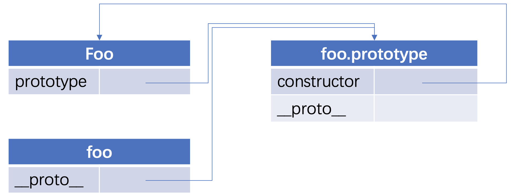
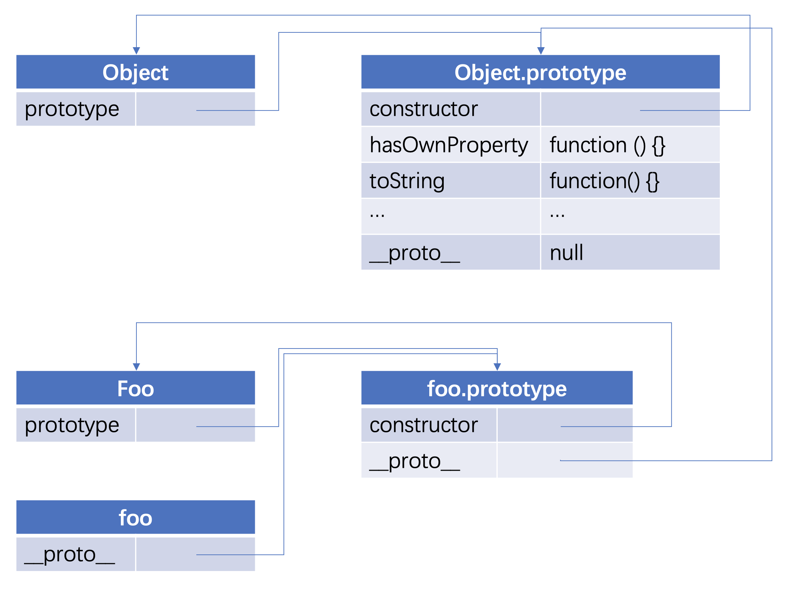

原型在平时工作中用得比较少, 但原型是 JavaScript 中的基础, 是构建大型应用, 框架不可或缺的一环, 是你在写代码时, 不知不觉就应用上了的一个最基础的知识. 

比如, React 和 Vue 的 git 仓库中, `prototype` 被使用到的次数分别为 `370` 次和 `1043` 次. 又比如你在使用 `class Foo extends React.Component;` 的时候, 你在使用 `const bar = {}; bar.hasOwnProperty('xxx'); bar.toString();` 的时候, 都不知不觉间用到了原型的知识

如果你还对原型一知半解, 是时候静下心把它弄懂了.

本文是一个系列, 该篇会介绍以下两个知识点

* 原型
* 原型链

让我们开始吧~

## 原型

任何一个函数, 都拥有一个 prototype 属性, 它指向这个函数的原型对象, 如

```js
function Foo () {}
console.log(Foo.prototype) // { constructor: f Foo(), __proto__: Object }
```

画图表示如下:


上图左边代表 `Foo` 函数, 它有一个 `prototype` 属性, 指向右侧这个原型对象, 每声明一个函数, 都会有这样的一个原型对象, 原型对象有一个 `constructor` 属性, 指向 `Foo` 函数本身, 也有个 `__proto__` 属性, 这里我们暂且不讲.

我们来看 `Foo` 函数的实例化:

```js
const foo = new Foo();
```

这里通过我们 `new` 操作符实例化了一个 `foo` 对象, 我们来看此时的图解:



`foo` 默认会有个 `__proto__` 属性, 它也指向构造函数 `Foo` 的原型, 这就是 `__proto__` 的作用, 即**指向构造函数的原型**, 那让我们回到 `Foo.prototype.__proto__`, 来看看他的指向吧:


上图的 `Foo.prototype.__proto__` 指向 `Object.prototype`, 也就是说, 每个函数的原型, 都是 Object 的实例. 就好像每个函数的原型, 是由 `new Object()` 产生一样

以上就是关于原型的阐述, 如果看到这里似懂非懂, 建议反复看几遍, 注意文字与图片对应, 线条的指向, 看懂了再接着往下看.

## 原型链

原型链是 JavaScript 作者为了继承而设计的, 由上边的分析, `const foo = new Foo()` 语句, 其实是产生了一个链条的, 如下:



我们在 new 出 `foo` 对象后, 并没有给 `foo` 对象添加任何方法, 但我们依然能从 `foo` 对象中调用 `toString()`, `hasOwnProperty()` 等方法. 这是为什么呢?

```js
console.log(typeof foo.toString); // function
console.log(typeof foo.hasOwnProperty); // function
```

原因是, JavaScript 在设计之初, `__proto__` 就是用来查找属性和方法的, 从上图的链条来看, 我们在 `foo` 这个对象中, 查找 toString 方法, 没找到, 就循着 `foo.__proto__` 查找, `foo.__proto__` 里也没有找到, 就循着 `foo.__proto__.__proto__` 找, 诶这个时候找到了, 则调用, 如果还找不到, 就再往上找, 即 `foo.__proto__._proto__._proto__`, 这个时候值为 `null`, 查找结束.

这就是原型链, 我们也可以说, `Foo` 继承了 `Object`, 所以 `foo` 中能访问到 Object 的原型属性.

原型链的内容就到这里, 更多关于继承的内容, 会在下一篇讲解.
